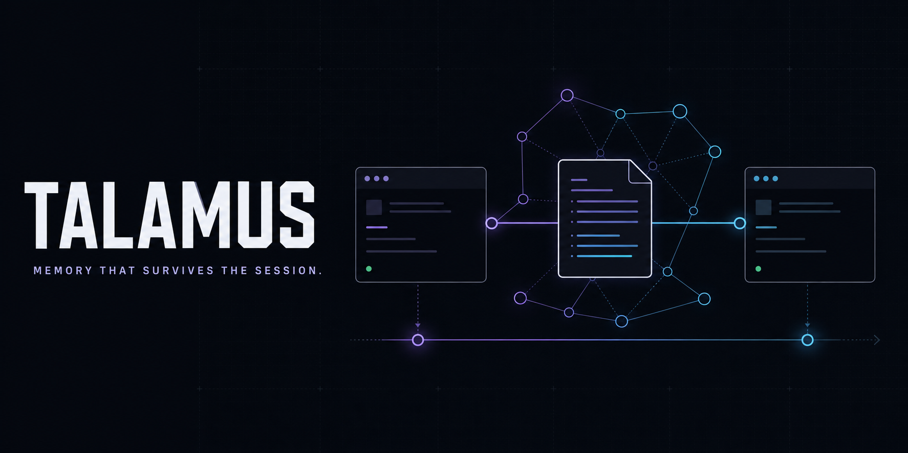

# Talamus

<!-- mcp-name: io.github.ampres-ai/talamus -->



[](https://github.com/ampres-ai/talamus/actions/workflows/ci.yml) [](https://pypi.org/project/talamus/) [](https://registry.modelcontextprotocol.io/v0.1/servers?search=io.github.ampres-ai%2Ftalamus)  

**Talamus is a local-first knowledge compiler — a second brain you and your AI agents share.**

**Your agent remembers. Locally. €0.**

It turns documents, notes, repos, URLs, and agent sessions into source-grounded Markdown concept notes, then answers from those notes with citations — powered entirely by the LLM you already have.


Talamus is an open-source project by [Ampres](https://ampres.io), an independent AI and open-source lab.

If Talamus makes agent memory less disposable, [star the repository](https://github.com/ampres-ai/talamus) so other builders can find it.

## The 60-second story

Copy-pasteable arc, with the reproducible version in [`scripts/demo/run_magic.py`](scripts/demo/run_magic.py):

1. Install the CLI.

   ```bash
   pipx install "talamus[mcp]"
   ```

2. Set up the project brain. `talamus setup` initializes the brain, chooses an engine, installs MCP for Claude Code/Cursor/codex, asks once before installing the session-capture hook, and can probe the engine with one tiny live call.

   ```bash
   talamus setup
   ```

3. Your agent session ends. The consented hook reads the transcript and git diff, applies the worth-remembering gate, writes only useful memory into this brain, and audits the event at `.talamus/logs/capture.log`.

4. A fresh session asks what happened and gets an answer from real notes, with sources.

   ```bash
   talamus recall "why did we choose FTS5?"
   talamus ask "why did we choose FTS5?"
   ```

5. Reproduce the scripted demo without spending LLM calls, or run it with your real engine.

   ```bash
   python scripts/demo/run_magic.py --fake
   python scripts/demo/run_magic.py --keep --engine claude-cli
   ```

## What is different

**TIME**: notes have version history, facts have valid-time windows, and `talamus ask --as-of 2026-01` answers from the brain as it was.

**MEANING**: the ontology is induced from evidence, versioned, promoted by measured rules, and used to cluster and route the brain.

**VERIFIABILITY**: every note carries provenance; `talamus verify` proposes corrections to review, and answers cite the notes they used.

## Measured comparison

The one-screen benchmark is rendered at [`docs/benchmarks.md`](docs/benchmarks.md) and committed at [`benchmarks/results/one-screen.md`](benchmarks/results/one-screen.md). Every number below traces to a committed artifact under [`benchmarks/results/`](benchmarks/results/).

| corpus | metric | Talamus | BM25 | MiniLM vector DB |
|---|---:|---:|---:|---:|
| SciFact, English-only turf | recall@10 | **0.797** | 0.776 | 0.783 |
| SciFact, English-only turf | nDCG | **0.664** | 0.652 | 0.645 |
| Book, cross-language + vague | hit@10 | **0.971** | 0.829 | 0.743 |
| Book, cross-language + vague | recall@10 | **0.929** | 0.771 | 0.700 |

Also measured: **−97.7% tokens** per answer versus loading the brain into context, **100%** source-resolvable answers, refusal **1.000** on out-of-scope questions, search latency p95 **72.6 ms** at 10k notes / p50 **624 ms** at 100k.

The honest part: retrieval quality tracks the LLM you bring. With a strong expansion engine, `talamus-smart` leads a strong multilingual dense model (`multilingual-e5`) on every metric including ranking (nDCG 0.847 vs 0.837); with a weak or free one, e5 leads ranking while Talamus keeps the best hit/recall — and on a slow local engine, plain `search` beats `--smart` outright. Every number traces to a committed artifact; the losses stay on the table.

## Engines

Bring the LLM you already have: `claude-cli`, `codex-cli`, `antigravity-cli` (agy), `opencode`, `ollama`, or `anthropic-api`.

## Quickstart

```bash
pipx install "talamus[mcp]"
talamus setup
talamus ingest ./notes && talamus ask "what should I remember?"
```

Run `talamus` for the status dashboard, `talamus quickstart` for essential commands, or `talamus ui` for the local React workbench.

## Links

Docs: [quickstart](docs/quickstart.md), [agent install guide](llms-install.md), [commands](docs/commands.md), [agent tool calling](docs/agent-tool-calling.md), [configuration](docs/configuration.md), [benchmarks](docs/benchmarks.md), [architecture](docs/architecture.md), [design principles](docs/design-principles.md), [evaluation](docs/evaluation.md), [multi-brain](docs/multi-brain.md), [ontology](docs/ontology.md).

Project: [security](SECURITY.md), [contributing](CONTRIBUTING.md), [roadmap](ROADMAP.md), [changelog](CHANGELOG.md).

Maintained by [Ampres](https://ampres.io). Source code and issue tracking live at [ampres-ai/talamus](https://github.com/ampres-ai/talamus).

## Development

```bash
pip install -e ".[dev,mcp]"
python dev.py
```

`python dev.py` runs ruff, format check, mypy, and unittest. Product behavior changes should update user docs in the same change.

## License

Apache-2.0.
